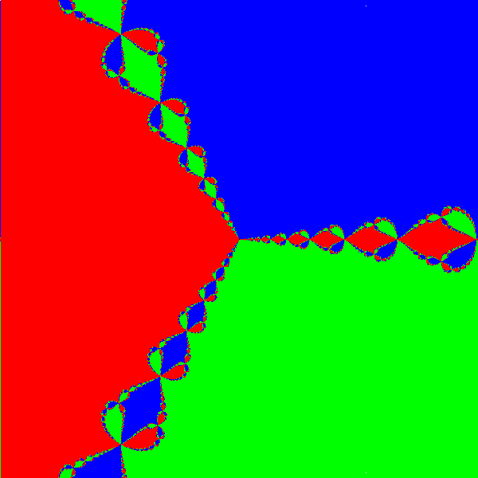
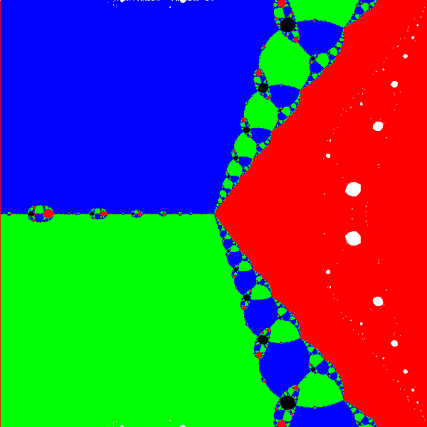

Programma per generare frattali di Newton (grafica anche la mappa dei coefficienti di Lyapunov) che ho usato per il mio progetto di sistemi dinamici (cdl in fisica).
Ho inserito anche il progetto in formato pdf.

.png)

1.png)

